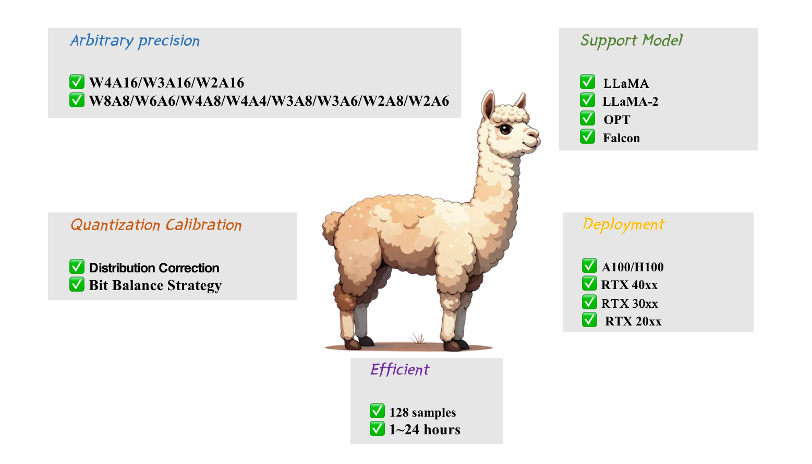
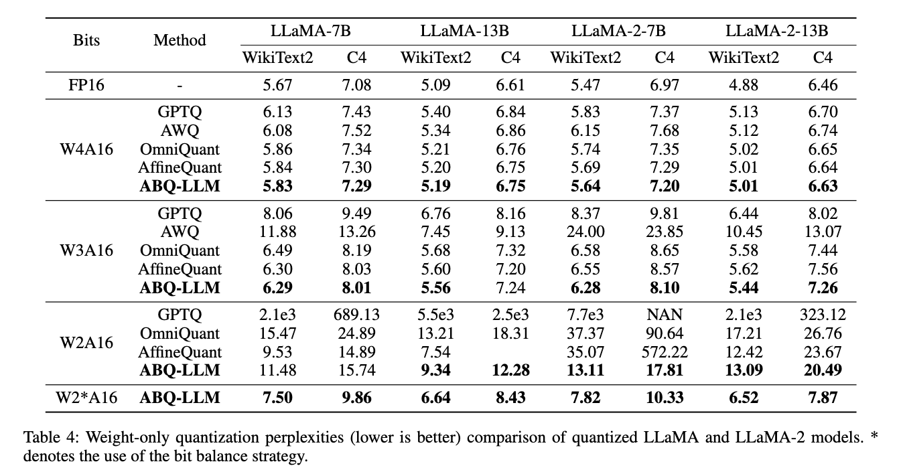
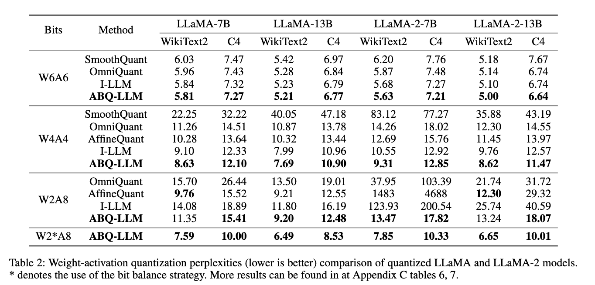
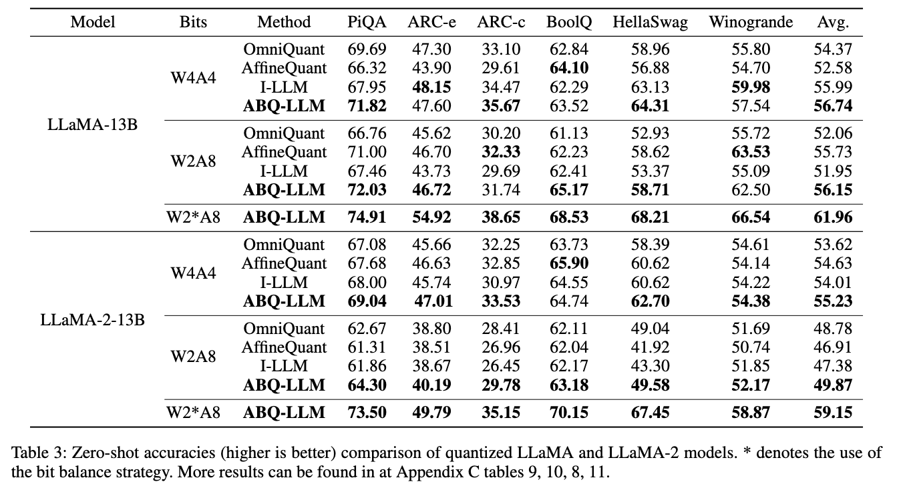

<h1 align="center">ABQ-LLM</h1

<p align="center">ABQ-LLM is a novel arbitrary bit quantization scheme that achieves excellent performance under various quantization settings while enabling efficient arbitrary bit computation at the inference level. </p>


The current release version supports the following features:
- The ABQ-LLM algorithm is employed for precise weight-only quantization (W8A16, W4A16, W3A16, W2A16) and weight-activation quantization (W8A8, W6A6, W4A4, W3A8, W3A6, W2A8, W2A6).
- Pre-trained ABQ-LLM model weights for LLM (LLaMA and LLaMA-2 loaded to run quantized models).
- A set of out-of-the-box arbitrary bit quantization operators that support arbitrary bit model inference in Turing and above architectures.


## Contents
- [Install](#install)
- [Model Zoo](#abq-llm-model-zoo)
- [Usage](#usage)
- [Results](#results)
- [Citation](#citation)

## Install

### Installation of the algorithmic runtime environment
```
conda create -n abq-llm python=3.10.0 -y
conda activate abq-llm
git clone https://github.com/bytedance/ABQ-LLM.git
cd ./ABQ-LLM/algorithm
pip install --upgrade pip 
pip install -r requirements.txt
```

### Installation of the inference engine environment
You can actually compile and test our quantized inference Kernel, but you need to install the basic CUDA Toolkit.
1. Install CUDA Toolkit (11.8 or 12.1, linux or windows). Use the Express Installation option. Installation may require a restart (windows).
2. Clone the CUTLASS. (It is only used for speed comparison)
```
git submodule init 
git submodule update
```


## ABQ-LLM Model

We provide pre-trained ABQ-LLM model zoo for multiple model families, including LLaMa-1&2, OPT.
The detailed support list:

| Models  | Sizes                           | W4A16 | W3A16 | W2A16 | W2A16g128 | W2A16g64|
| ------- | ------------------------------- | ----- | --------- | -------- | ----- |----- |
| LLaMA   | 7B/13B  | ✅     | ✅         | ✅        | ✅     |✅     |
| LLaMA-2 | 7B/13B  | ✅     | ✅         | ✅        | ✅     |✅     |


| Models       | Sizes                           | W8A8 | W4A8 | W6A6 | W4A6 | W4A4 | W3A8 | W3A6 | W2A8 | W2A6 |
| ------------ | ------------------------------- | --------- | ----- | --------- | ---- | ---- |---- |---- |---- |---- |
| LLaMA        | 7B/13B                  | ✅         | ✅     | ✅         | ✅    | ✅    | ✅    | ✅    | ✅    |✅    |
| LLaMA-2      | 7B/13B                     | ✅         | ✅     | ✅         | ✅    | ✅    | ✅    | ✅    | ✅    |✅    |


## Usage

### Algorithm Testing
We provide the pre-trained ABQ- LLM model weight in hugginface, you can verify the model performance by the following commands.
```
CUDA_VISIBLE_DEVICES=0 python run_pretrain_abq_model.py \
--model /PATH/TO/LLaMA/llama-7b-ABQ \
--wbits 4 --abits 4
```

We also provide full script to run ABQ-LLM in **`./algorithm/scripts/`**. We use LLaMa-7B as an example here:
1. Obtain the channel-wise scales and shifts required for initialization:
```
python generate_act_scale_shift.py --model /PATH/TO/LLaMA/llama-7b
```

2. Weight-only quantization
```
# W3A16
CUDA_VISIBLE_DEVICES=0 python main.py \
--model /PATH/TO/LLaMA/llama-7b  \
--epochs 20 --output_dir ./log/llama-7b-w3a16 \
--eval_ppl --wbits 3 --abits 16  --lwc --let

# W3A16g128
CUDA_VISIBLE_DEVICES=0 python main.py \
--model /PATH/TO/LLaMA/llama-7b  \
--epochs 20 --output_dir ./log/llama-7b-w3a16g128 \
--eval_ppl --wbits 3 --abits 16 --group_size 128 --lwc --let
```

3. weight-activation quantization
```
# W4A4
CUDA_VISIBLE_DEVICES=0 python main.py \
--model /PATH/TO/LLaMA/llama-7b  \
--epochs 20 --output_dir ./log/llama-7b-w4a4 \
--eval_ppl --wbits 4 --abits 4 --lwc --let \
--tasks piqa,arc_easy,arc_challenge,boolq,hellaswag,winogrande
```

More detailed and optional arguments:
- `--model`: the local model path or huggingface format.
- `--wbits`: weight quantization bits.
- `--abits`: activation quantization bits.
- `--group_size`: group size of weight quantization. If no set, use per-channel quantization for weight as default.
- `--lwc`: activate the Learnable Weight Clipping (LWC).
- `--let`: activate the Learnable Equivalent Transformation (LET).
- `--lwc_lr`: learning rate of LWC parameters, 1e-2 as default.
- `--let_lr`: learning rate of LET parameters, 5e-3 as default.
- `--epochs`: training epochs. You can set it as 0 to evaluate pre-trained ABQ-LLM checkpoints.
- `--nsamples`: number of calibration samples, 128 as default.
- `--eval_ppl`: evaluating the perplexity of quantized models.
- `--tasks`: evaluating zero-shot tasks.
- `--multigpu`: to inference larger network on multiple GPUs
- `--real_quant`: real quantization, which can see memory reduce. Note that due to the limitations of AutoGPTQ kernels, the real quantization of weight-only quantization can only lead memory reduction, but with slower inference speed.
- `--save_dir`: saving the quantization model for further exploration.

### Kernel Benchmark
1. Compile Kernels.

By default, w2a2, w3a3, w4a4, w5a5, w6a6, w7a7, w8a8 are compiled, and the kernel of w2a4, w2a6, w2a8, and w4a8 quantization combination is compiled. Each quantization scheme corresponds to dozens of kernel implementation schemes to build its search space.
```
# linux
cd engine
bash build.sh

# windows
cd engine
build.bat
```


2. Comprehensive benchmark.

For the typical GEMM operation of the llama model, different quantization combinations (w2a2, w3a3, w4a4,w5a5, w6a6, w7a7, w8a8, w2a4, w2a6, w2a8, w4a8) are tested to obtain the optimal performance in the search space of each quantization combination.
```
# linux
bash test.sh
# windows
test.bat
```

3. Add new quantization combinations(Optional).

We reconstructed the quantized matrix multiplication operation in a clever way, decomposing it into a series of binary matrix multiplications, and performed a high degree of template and computational model abstraction.

Based on the above optimizations, you can quickly expand our code to support new quantization combinations, such as w`p`a`q`. You only need to add w`p`a`q` instantiation definition and declaration files in engine/mma_any/aq_wmma_impl and then recompile.

The performance upper limit depends on how the search space is defined (the instantiated function configuration). For related experience, please refer to the paper or the existing implementation in this directory.

### E2E Benchmark

1. Compile the fastertransformer
```
cd fastertransformer
bash build.sh
``` 

2. Config llama (Change precision in examples/cpp/llama/llama_config.ini)
```
fp16:  int8_mode=0
w8a16: int8_mode=1
w8a8:  int8_mode=2
w4a16: int8_mode=4
w2a8:  int8_mode=5
```

3. Run llama on single GPU
```
cd build_release
./bin/llama_example
```

4. (Optional) Run in multi GPU. Change tensor_para_size=2 in examples/cpp/llama/llama_config.ini

```
cd build_release
mpirun -n 2 ./bin/llama_example
```

## Results
- ABQ-LLM achieve SoTA performance in weight-only quantization

- ABQ-LLM achieve SoTA performance in weight-activation quantization

- ABQ-LLM achieve SoTA performance in zero-shot task

- On kernel inference acceleration, ABQ- LLM achieves performance gains that far exceed those of CUTLASS and CUBLAS.

- We integrated our ABQKernel into FastTransformer and compared it with the FP16 version of FastTransformer and the INT8 version of SmoothQuant. Our approach achieved a 2.8x speedup and 4.8x memory compression over FP16, using only 10GB of memory on LLaMA-30B, less than what FP16 requires for LLaMA-7B. Additionally, it outperformed SmoothQuant with a 1.6x speedup and 2.7x memory compression.


## Related Project
[SmoothQuant: Accurate and Efficient Post-Training Quantization for Large Language Models](https://github.com/mit-han-lab/smoothquant)

[AWQ: Activation-aware Weight Quantization for LLM Compression and Acceleration](https://github.com/mit-han-lab/llm-awq)

[GPTQ: Accurate Post-training Compression for Generative Pretrained Transformers](https://github.com/IST-DASLab/gptq)

[RPTQ: Reorder-Based Post-Training Quantization for Large Language Models](https://github.com/hahnyuan/RPTQ4LLM)

[OmniQuant is a simple and powerful quantization technique for LLMs](https://github.com/OpenGVLab/OmniQuant)


## Citation
If you use our ABQ-LLM approach in your research, please cite our paper:
```
@article{zeng2024abq,
  title={ABQ-LLM: Arbitrary-Bit Quantized Inference Acceleration for Large Language Models},
  author={Zeng, Chao and Liu, Songwei and Xie, Yusheng and Liu, Hong and Wang, Xiaojian and Wei, Miao and Yang, Shu and Chen, Fangmin and Mei, Xing},
  journal={arXiv preprint arXiv:2408.08554},
  year={2024}
}
```
